# Assignment 1

## Task 1 -- Acquisition

**Process the IF data using a GNSS SDR and generate initial acquisition outputs.**

1. **Open air results:**

   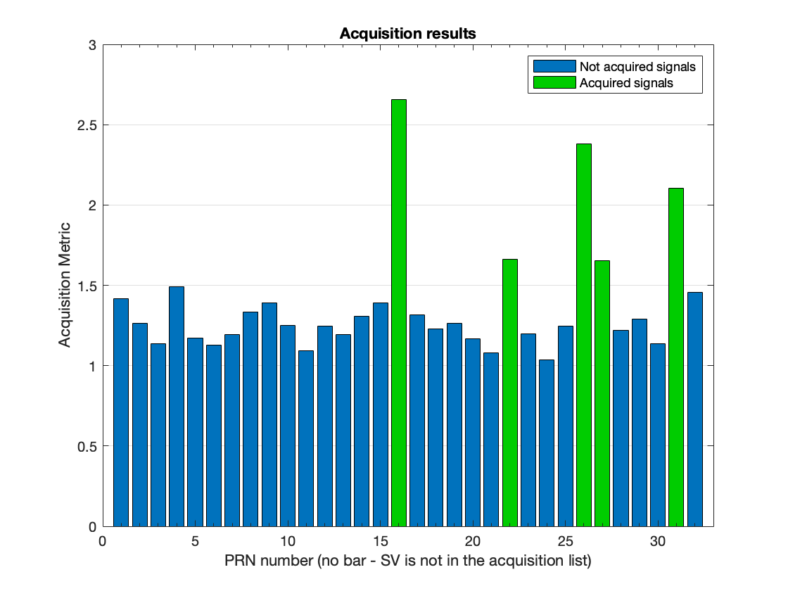

2. **Urban results:**

   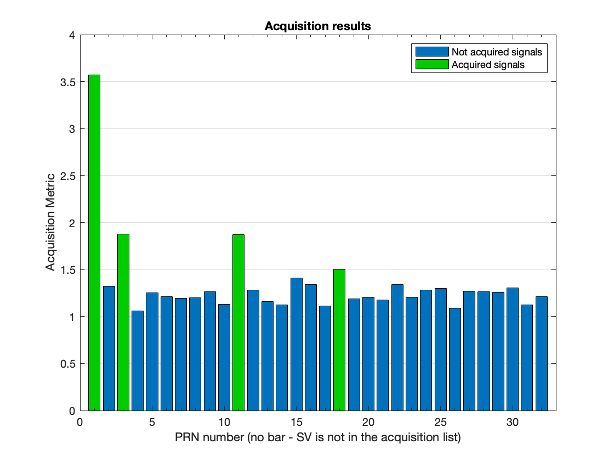

## Task 2 -- Tracking

**Adapt the tracking loop (DLL) to produce correlation plots and analyze the tracking performance. Discuss the impact of urban interference on the correlation peaks. (Multiple correlators must be implemented for plotting the correlation function)**

1. **Open air results:**

   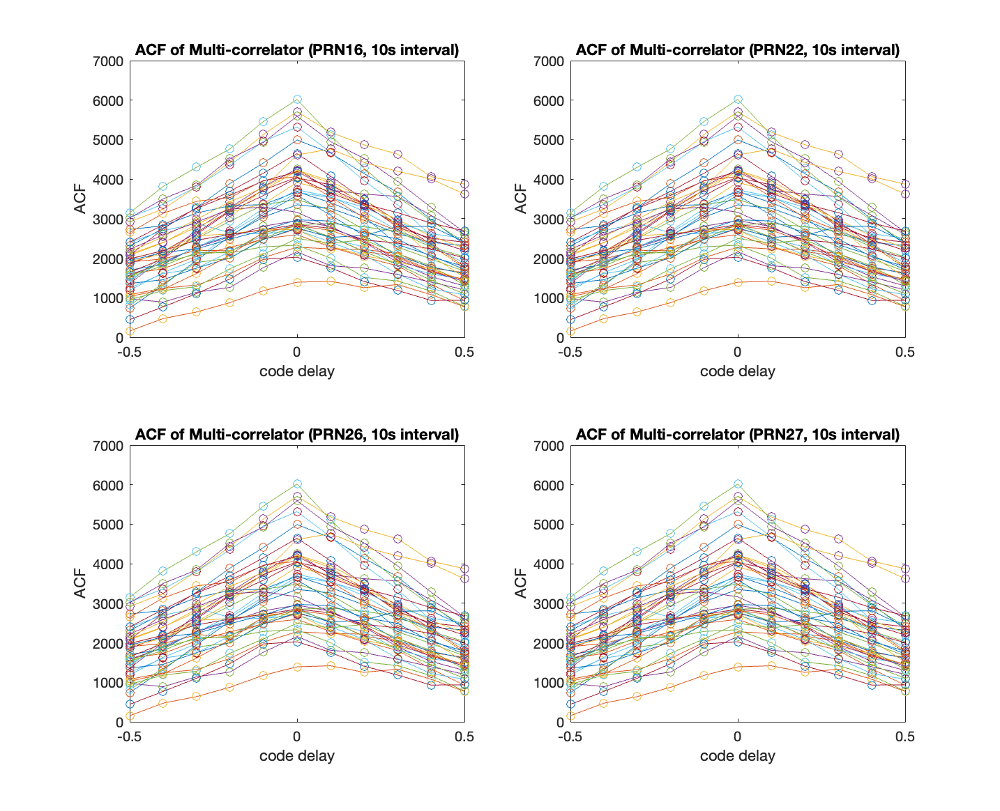

3. **Urban results:**

   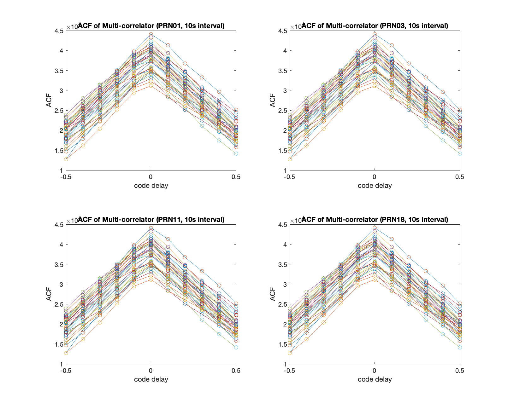

4. **The impact of urban interference on the correlation peaks:**

   a. Firstly, the values of Auto-correlation functions (ACF) in urban areas are much smaller than most of the ACF values in open sky areas, which is because the propagation of signals in open sky areas suffered less interference.

   b. Secondly, the variation of ACF values in urban areas are less than that in open sky areas. This is probably due to that the signals that encounter interference in urban environments are not tracked, only the reliable satellites are received, causing a survivorship bias.

## Task 3 -- Navigation data decoding

**Decode the navigation message and extract key parameters, such as ephemeris data, for at least one satellite.**

- **Table showing the decoded ephemeris parameters for urban experiment:**

The following table shows the decoded ephemeris parameters for the urban experiment:

| PRN  | C_ic                  | omega_0               | C_is                  | i_0                   | C_rc   | omega                | omegaDot             | IODE_sf3 | iDot                  | idValid | weekNumber | Accuracy | health | T_GD                  | IODC | t_oc   | a_f2 | a_f1                  | a_f0                  | IODE_sf2 | C_rs     | deltan                | M_0                   | C_uc                  | e                     | C_us                  | sqrtA           | t_oe   | TOW     |
|------|-----------------------|-----------------------|-----------------------|-----------------------|--------|-----------------------|-----------------------|----------|-----------------------|---------|------------|----------|--------|-----------------------|------|--------|------|-----------------------|-----------------------|----------|----------|-----------------------|-----------------------|-----------------------|-----------------------|-----------------------|----------------|--------|---------|
| PRN01| -7.45058059692383e-08 | -3.10603580061844     | 1.60187482833862e-07  | 0.976127704025531     | 287.46875 | 0.711497598513721    | -8.16962601200124e-09 | 72       | -1.81078971237415e-10 | [2,0,3] | 1032       | 0        | 0      | 5.58793544769287e-09  | 12   | 453600 | 0    | -9.43600753089413e-12 | -3.48975881934166e-05 | 72       | -120.71875 | 4.19088885305686e-09  | 0.517930887728972     | -6.33485615253449e-06 | 0.00892308494076133   | 5.3010880947113e-06   | 5153.65564346314 | 453600 | 449352  |
| PRN03| 1.11758708953857e-08  | -2.06417843827738     | 5.21540641784668e-08  | 0.96285874592588      | 160.3125 | 0.594974558438532    | -7.83246911092014e-09 | 72       | 4.81091467962126e-10  | [2,0,3] | 1032       | 0        | 0      | 1.86264514923096e-09  | 4    | 453600 | 0    | -1.13686837721616e-12 | 0.000186326447874308  | 72       | -62.09375 | 4.44768526394384e-09  | -0.430397463873375    | -3.09012830257416e-06 | 0.00222623045556247   | 1.15595757961273e-05  | 5153.77780151367 | 453600 | 449352  |
| PRN11| -3.16649675369263e-07 | 2.72577037566571      | -1.32247805595398e-07 | 0.909806735685279     | 324.40625 | 1.89149296226273     | -9.3043161335422e-09  | 83       | 1.28576784310591e-11  | [2,0,3] | 1032       | 0        | 0      | -1.2572854757309e-08  | 229  | 453600 | 0    | 8.5265128291212e-12   | -0.00059009250253439   | 83       | -67.125   | 5.89095966783022e-09  | -0.198905418191913    | -3.6042183637619e-06  | 0.0166431387187913    | 1.51246786117554e-06  | 5153.70659637451 | 453600 | 449352  |
| PRN18| -2.5331974029541e-07  | 3.12182125430595      | 3.53902578353882e-08  | 0.954642600078998     | 280.15625 | 1.39301587576552     | -8.61071581373341e-09 | 56       | -1.61792453590826e-10 | [2,0,3] | 1032       | 0        | 0      | -5.58793544769287e-09 | 244  | 453600 | 0    | 3.18323145620525e-12  | 5.98649494349957e-05  | 56       | -113.875  | 4.72019661513546e-09  | 0.259840988631583     | -6.10947608947754e-06 | 0.0154198176460341    | 5.11482357978821e-06  | 5153.69931793213 | 453600 | 449352  |

## Task 4 -- Position and velocity estimation

**Using the pseudorange measurements obtained from tracking, implement the Weighted Least Squares (WLS) algorithm to compute user’s position and velocity. Plot the user position and velocity, compare it to the provided ground truth values, and comment on the impact of multipath effects on the WLS solution.**

1. **Open air results:**

   a. **Position**

   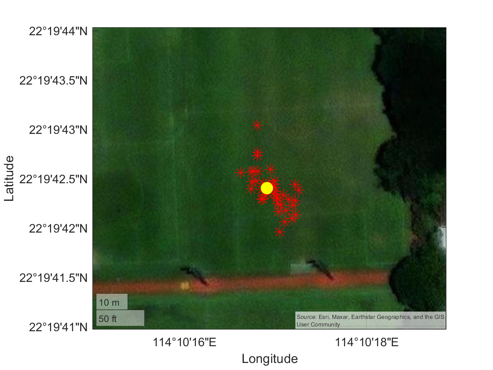

   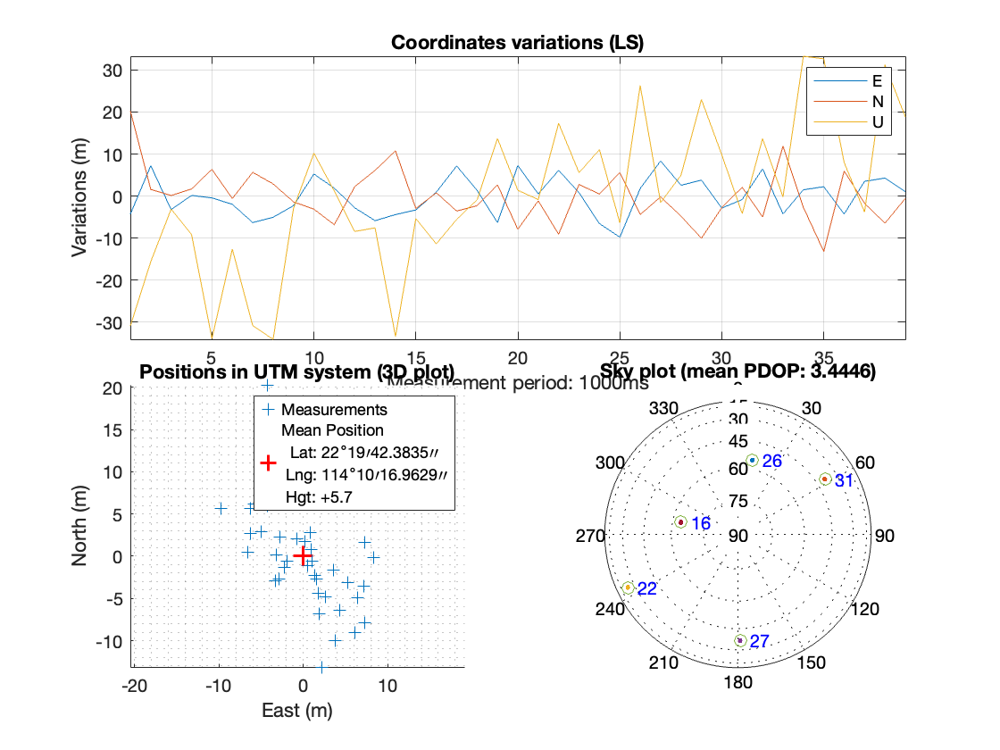

   b. **Velocity**

   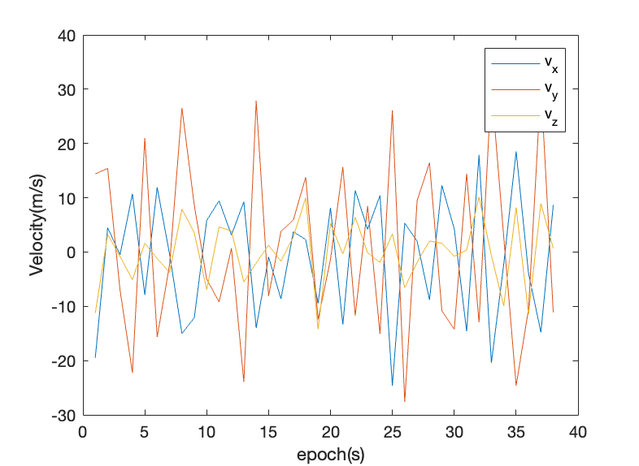

2. **Urban results:**

   a. **Position**

   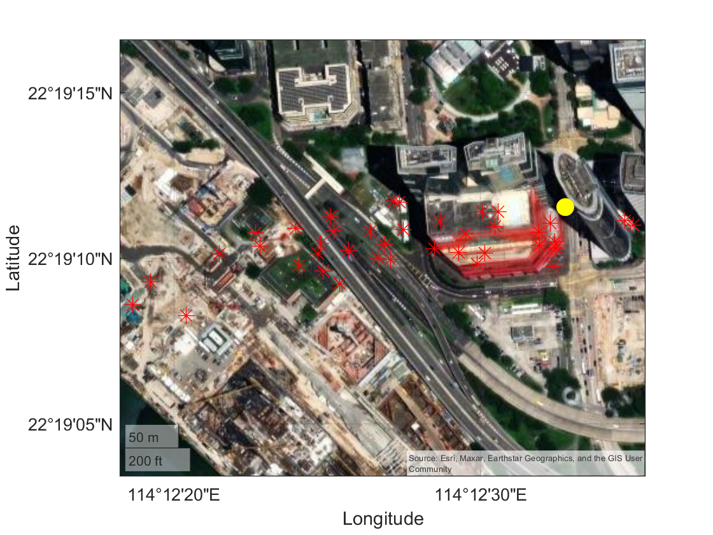

   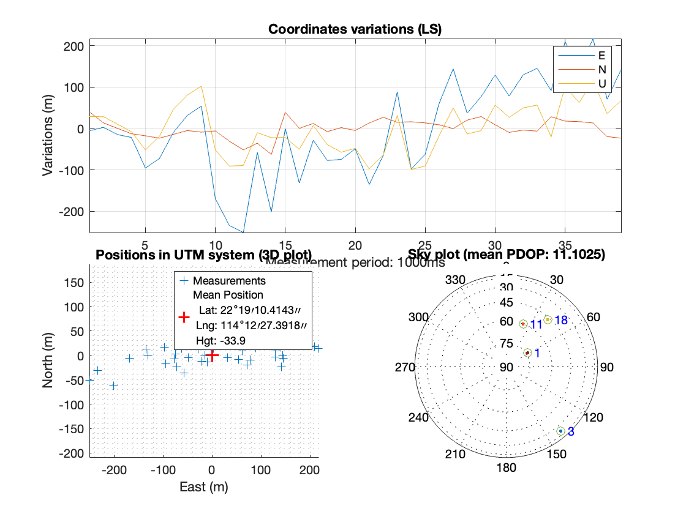

   b. **Velocity**

   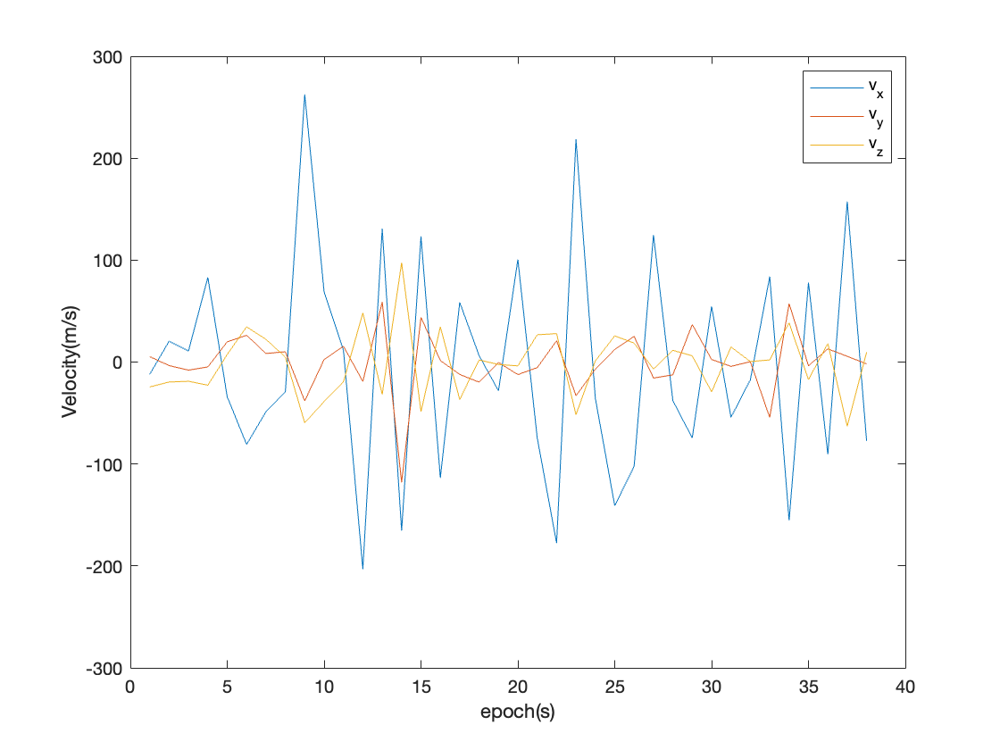

3. **The impact of multipath effect on the WLS solution:**

   The positioning errors in open sky areas are mostly less than 30 meters, while in urban areas are large to 100 meters. In urban areas, the error in East direction is extremely large, which is due to the blockage of satellites in the west by buildings, which makes the PDOP very large in urban areas.

## Task 5 -- Kalman filter-based positioning

**Develop an Extended Kalman Filter (EKF) using pseudorange and Doppler measurements to estimate user position and velocity.**

1. **Open air results:**

   a. **Position**

   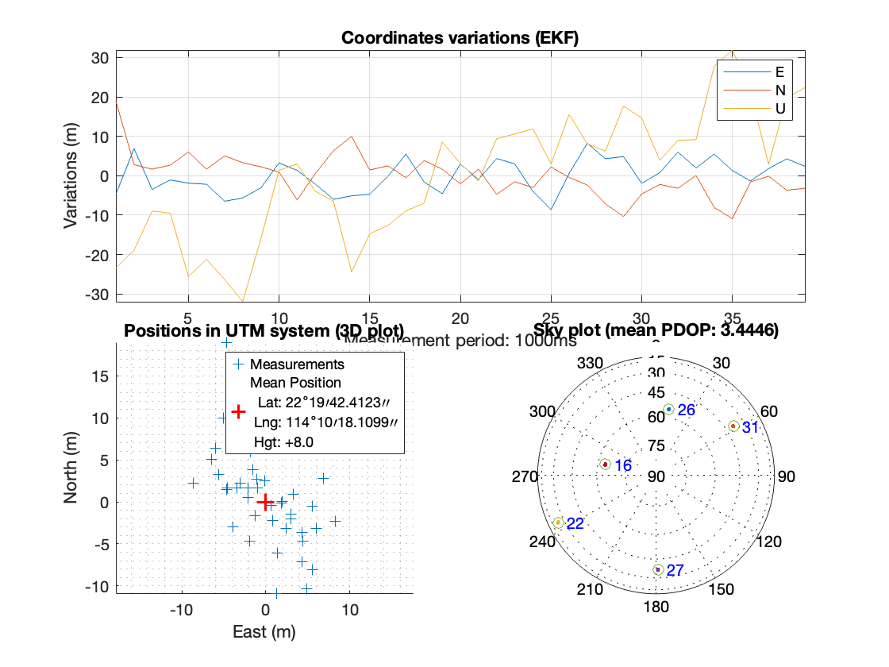

   b. **Velocity**

   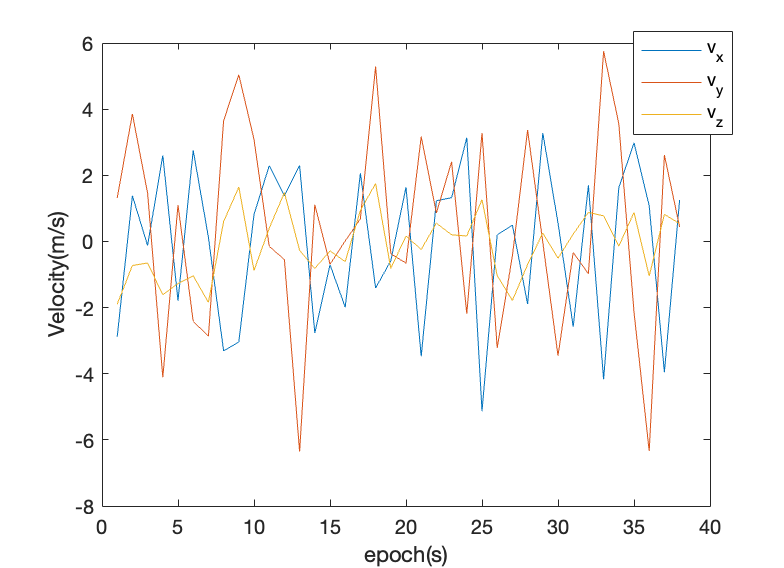

2. **Urban results:**

   a. **Position**

   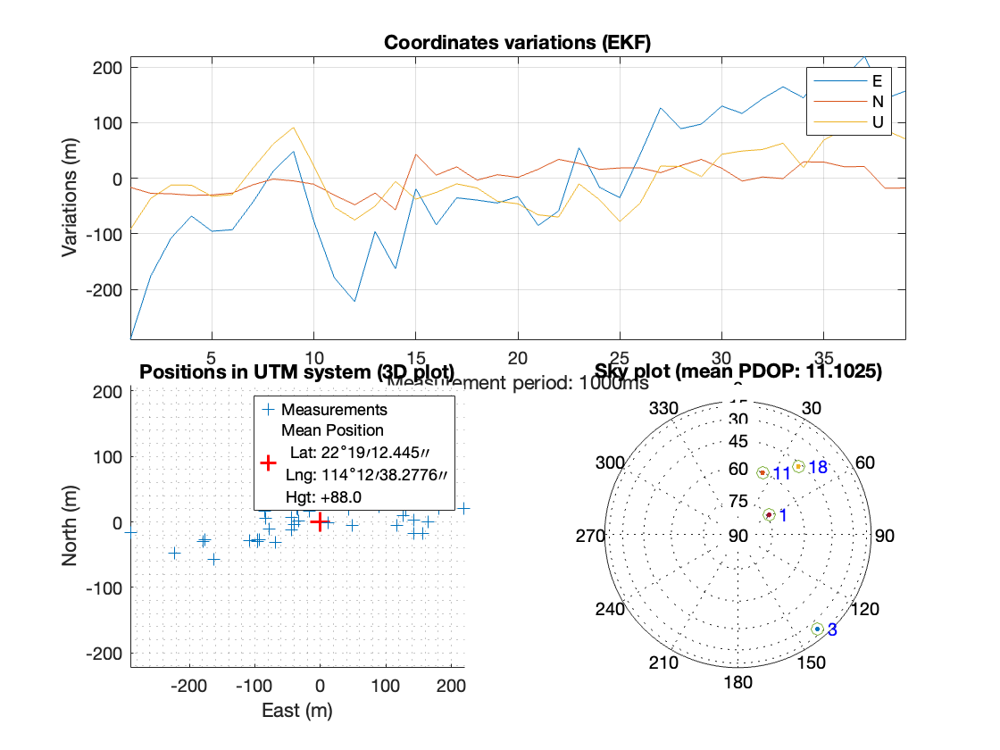

   b. **Velocity**

   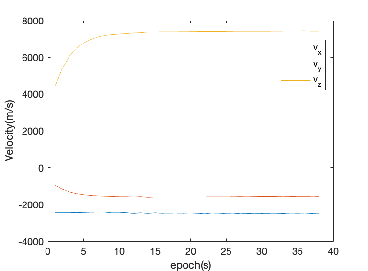

3. **EKF using pseudorange and Doppler**

   a. The doppler shift measurements can be calculated as the difference between the carrier frequency tracked by SDR and the designed transmitted carrier frequency.

   b. The velocity estimation method is based on a reference (Ji, L., Sun, R., Cheng, Q., & Wang, J. (2022). Evaluation of the performance of GNSS-based velocity estimation algorithms. Satellite Navigation, 3(1), 18. [https://doi.org/10.1186/s43020-022-00080-4](https://doi.org/10.1186/s43020-022-00080-4)).

   c. Velocity estimation method is realized in `rec_vel.m` file. EKF method is realized in `ekf_gnss.m` file. Baoshan Song contributed to part of the modification in `postNavigation.m` and `plotNavigation.m` files.
